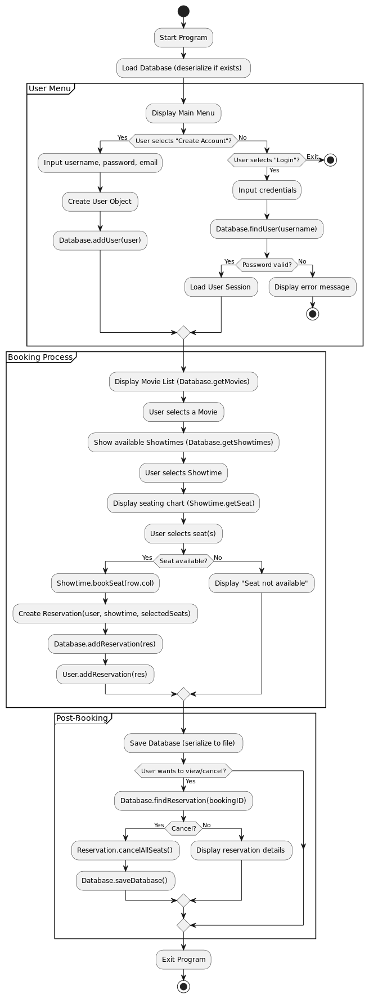

## Project Description

For our project, we selected **Option 2**, which involves building an **Movie Ticket Booking System**. The goal of this project is to design and implement a modular, object-oriented system that accurately simulates how an industrial-style movie booking platform operates.

This phase establishes the core database framework, including:
- **Movie** – stores movie details such as title, genre, runtime, and poster path.
- **Showtime** – manages screening schedules, seating arrangements, and booking states.
- **User** – represents individual customers (or admins) capable of making and canceling reservations.
- **Reservation** – handles the linkage between users, showtimes, and booked seats.
- **Database** – provides centralized, synchronized data storage with support for saving and loading the system state using serialization.

Each component has been tested through **JUnit 5** test cases to validate appropriate functionality.

---
## Testing Instructions: 
# **Compilation & Execution Guide**

This project is developed and tested using **JUnit 5** and requires **Java 17 or later**.  
Please follow all instructions below carefully to ensure successful compilation and execution.

---

## **1. Overview**

This phase of the project focuses on backend implementation and verification through **JUnit 5** test cases.  
There is **no main program** yet — all validation happens through automated unit testing.  
The guide below explains how to set up, compile, and run the tests in both an **IDE** and via the **command line**.

---

## **2. System Requirements**

Before starting, make sure the following software is installed and configured correctly:

### ✅ **Java Development Kit (JDK 17 or later)**  
To verify installation, open a terminal or command prompt and run:

java -version

## Tentative Expected End Goal

By the end of the full project, the system will evolve into an application that allows users to:
- Browse available movies and showtimes.
- Select and reserve seats in real time.
- Handle concurrent booking operations safely.
- Store user and reservation data persistently through serialization or database integration (this feature will be abstracted from the user).
- Hashed password storage.
- Include a graphical interface for enhanced interactivity.
- Provide administrative functions for adding movies, managing showtimes, and tracking sales.
- Purchase their selected seats and reeive a payment confirmation for the same.
- Schedule their bookings upto 7 days in advance.
- Receive a unique booking ID either on the purchase screen or via email.

--- 

## Tentative User Flow Diagram

The following diagram flowchart displays how a user might interact with our program:

---

## Team Member Contributions

### Gaurav Mandhyan
- **Role:** Team Leader
- **Main Responsibilities:**
    - Created class descriptions in early stages.
    - Created and implemented User class, Database class.
    - Created and implemented User interface, Database interface.
    - Created and implemented User test class, Database test class.
    - Managed deadlines and distributed work.
    - Wrote associated ReadMe sections.
---

### Naisha Patel
- **Main Responsibilities:**
    - Set up GitHub repository and file structure.
    - Created and implemented Movie class, Showtime class.
    - Created and implemented Movie interface, Showtime interface.
    - Created and implemented Movie test class, Showtime test class.
    - Wrote associated ReadMe sections.
    - Wrote compilation guide for the ReadMe.

---

### Arbin
- **Main Responsibilities:**
    - Created and implemented Seat class.
    - Created and implemented Seat interface.
    - Created and implemented Seat test class.
    - Wrote associated ReadMe sections.
    - Created User flow diagram.

---

### Jakob
- **Main Responsibilities:**
    - Created and implemented Reservation class.
    - Created and implemented Reservation interface.
    - Created and implemented Reservation test class.
    - Wrote associated ReadMe sections.
    - Created User flow diagram.
---

CLASS DESCRIPTIONS
---

## User Class

### **Class Overview**
The `User` class represents an individual account in the system.  
It manages user authentication, role (admin or normal), and links the user to their active and historical reservations.  
This class also ensures secure password handling through hashing.

---

### **Field Table**

| Field Name | Access Modifier | Type | Description |
|:-------------|:----------------|:------|:--------------|
| `username` | private | String | Unique identifier chosen by the user to log in. |
| `passwordHash` | private | String | MD5 hashed version of the user's password used for secure verification. |
| `email` | private | String | User’s email used for contact or verification. |
| `isAdmin` | private | boolean | Specifies whether the user has administrative privileges. |
| `reservations` | private | ArrayList<Reservation> | List of all reservations linked to this user. |

---

### **Method Table**

| Method Name | Return Type | Access Modifier | Parameters | Description | How It Was Tested |
|:--------------|:--------------|:----------------|:-------------|:---------------|:--------------------|
| `User(String username, String password, String email, boolean isAdmin)` | Constructor | public | username, password, email, isAdmin | Initializes a new user and hashes the given password. | Verified field storage and password hashing in test cases. |
| `getUsername()` | String | public | None | Returns the username of this user. | Tested through `UserTest`. |
| `getPasswordHash()` | String | public | None | Returns the stored hashed password. | Tested through `UserTest`. |
| `verifyPassword(String password)` | boolean | public | password | Hashes input password and compares with stored hash to authenticate user. | Tested with valid and invalid passwords. |
| `hashPassword(String password)` | String | public | password | Converts a plain text password into its MD5-hashed representation. Used logic from: [MD5 Hash Tutorial](https://www.youtube.com/watch?v=ef3kenC4xa0) | None Required |
| `getEmail()` | String | public | None | Returns user’s registered email. | Tested manually through constructor verification. |
| `isAdmin()` | boolean | public | None | Returns admin status. | None Required |
| `getReservations()` | ArrayList<Reservation> | public | None | Returns list of user’s reservations. | Verified in test cases involving multiple reservations. |
| `addReservation(Reservation r)` | void | public | Reservation r | Adds a new reservation to user’s list. | Verified list size increment in test cases. |
| `removeReservation(String bookingID)` | void | public | bookingID | Removes reservation matching the provided ID. | Verified by removing valid and invalid IDs. |
| `toString()` | String | public | None | Returns a formatted string representing the user’s details (username, email, admin status, and number of reservations). | None Required |

---

## Database Class

### **Class Overview**
The `Database` class serves as the centralized storage of all system data: users, movies, showtimes, and reservations.  
It also handles persistence by saving and loading serialized data to and from disk, ensuring data is maintained between program executions.  
All modification methods are synchronized to ensure thread-safe access for concurrent client operations.

---

### **Field Table**

| Field Name | Access Modifier | Type | Description |
|:-------------|:----------------|:------|:--------------|
| `users` | private | List<User> | Stores all registered users. |
| `movies` | private | List<Movie> | Stores all available movies. |
| `showtimes` | private | List<Showtime> | Stores all showtime instances. |
| `reservations` | private | List<Reservation> | Stores all active reservations. |
| `filePath` | private final | String | Path for saving serialized database file (`myDataBase.ser`). |

---

### **Method Table**

| Method Name | Return Type | Access Modifier | Parameters | Description | How It Was Tested |
|:--------------|:--------------|:----------------|:-------------|:---------------|:--------------------|
| `Database()` | Constructor | public | None | Initializes all collections for users, movies, showtimes, and reservations. | Verified empty lists on initialization. |
| `addUser(User u)` | void | public | User u | Adds a new user to the system. | Tested through `DatabaseTest`. |
| `removeUser(String username)` | void | public | username | Removes user with matching username. | Verified in `DatabaseTest`. |
| `findUser(String username)` | User | public | username | Returns the user with given username or null if not found. | Verified existing and non-existent usernames. |
| `getUsers()` | List<User> | public | None | Returns all users currently stored in the database. | Tested indirectly by verifying list size. |
| `addMovie(Movie m)` | void | public | Movie m | Adds a movie to the database. | None Required |
| `removeMovie(String title)` | void | public | title | Removes a movie based on its title. | None Required |
| `addShowtime(Showtime s)` | void | public | Showtime s | Adds a showtime instance. | None Required |
| `findShowtime(Movie m, LocalDateTime dt)` | Showtime | public | Movie m, LocalDateTime dt | Finds a showtime for a movie at a given time. | None Required |
| `addReservation(Reservation r)` | void | public | Reservation r | Adds reservation record to system. | Tested through reservation addition checks. |
| `removeReservation(String bookingID)` | void | public | bookingID | Removes reservation with specified ID. | Tested by removing and rechecking reservation count. |
| `findReservation(String bookingID)` | Reservation | public | bookingID | Finds reservation with given ID. | Verified by comparing booking IDs. |
| `getMovies()` | List<Movie> | public | None | Returns all movies currently in database. | None Required |
| `getShowtimes()` | List<Showtime> | public | None | Returns all showtimes currently in database. | None Required |
| `getReservations()` | List<Reservation> | public | None | Returns all reservations in system. | Tested via list size after multiple additions. |
| `saveDatabase()` | void | public | None | Serializes and saves data to disk at filePath. | None Required |
| `loadDatabase()` | IDatabase | public | None | Loads serialized data from disk back into memory. | None Required |
| `clearAll()` | void | public | None | Clears all stored entities (used mainly in testing). | Tested through JUnit by verifying all lists empty after call. |

---

## Reservation Class

### **Class Overview**
The `Reservation` class is a data-carrying object that represents a single, confirmed booking. It acts as a "receipt," linking a specific `User` to one or more `Seat` objects for a given `Showtime`.
It is created when a user finalizes their seat selection. The class constructor handles the task of telling the `Showtime` to mark the seats as booked, and its `cancelAllSeats` method tells the `Showtime` to free them.

---

### **Field Table**

| Field Name    | Access Modifier | Type            | Description                                            |
|:--------------|:----------------|:----------------|:-------------------------------------------------------|
| `bookingID`   | private final   | String          | A unique ID identifying this specific reservation.     |
| `user`        | private final   | User            | The user account that owns this reservation.           |
| `showtime`    | private final   | Showtime        | The specific showtime this reservation is for.         |
| `bookedSeats` | private final   | ArrayList<Seat> | The list of Seat objects associated with this booking. |
| `bookingTime` | private final   | LocalDateTime   | The timestamp of when the reservation was created.     |

---

### **Method Table**

| Method Name        | Return Type     | Access Modifier | Parameters                                          | Description                                                                                                      | How It Was Tested                                                                                                                                                                                        |
|:-------------------|:----------------|:----------------|:----------------------------------------------------|:-----------------------------------------------------------------------------------------------------------------|:---------------------------------------------------------------------------------------------------------------------------------------------------------------------------------------------------------|
| `Reservation()`    | Constructor     | public | User user, Showtime showtime, ArrayList<Seat> seats | Initializes all fields, generates a bookingID and bookingTime, and tells the Showtime to book each seat.         | Verified by checking `showtime.isSeatAvailable()` returned `false` after creation.                                                                                                                       |
| `getBookingID()`   | String          | public | None                                                | Returns this reservation's unique ID.                                                                            | Verified that the returned ID was not null or empty.                                                                                                                                                     |
| `getUser()`        | User            | public | None                                                | Returns the `User` who made this booking.                                                                        | Verified the returned `User` object was the same one passed to the constructor.                                                                                                                          |
| `getShowtime()`    | Showtime        | public | None                                                | Returns the associated `Showtime`.                                                                               | Verified the returned `Showtime` object was the same one passed to the constructor.                                                                                                                      |
| `getBookedSeats()` | ArrayList<Seat> | public | None                                                | Returns the list of seats reserved.                                                                              | Verified by checking the list size and for the presence of the specific `Seat` objects.                                                                                                                  |
| `getBookingTime()` | LocalDateTime   | public | None                                                | Returns the timestamp of reservation creation.                                                                   | Verified that the returned `LocalDateTime` was not null.                                                                                                                                                 |
| `getTotalPrice()`  | double          | public | None                                                | Calculates and returns the total cost by summing the price of each individual seat in `bookedSeats`.             | Verified by comparing the return value to a pre-calculated sum of the seats' prices.                                                                                                                     |
| `cancelAllSeats()` | void            | public | None                                                | Frees all seats in this reservation by calling `showtime.cancelSeat()` for each one, then clears the local list. | Verified the internal seat list was empty and that `showtime.isSeatAvailable()` returned `true` for the seats.                                                                                                                                                                                                         |

---

## **Movie Class**

### **Class Overview**
The `Movie` class models the core data attributes of a film shown in the system.  
It provides a clean, immutable structure for storing and retrieving movie details such as title, genre, rating, runtime, and poster path.  
This class is serializable and implements the `IMovie` interface to ensure cross-module compatibility.

---

### **Field Table**

| Field Name | Access Modifier | Type | Description |
|:------------|:----------------|:------|:--------------|
| `title` | private final | String | The name of the movie; serves as a unique identifier. |
| `genre` | private final | String | The genre or category of the movie (e.g., Action, Comedy, Drama). |
| `rating` | private final | String | The rating of the movie (e.g., PG-13, R). |
| `runtime` | private final | int | Duration of the movie in minutes; cannot be negative. |
| `posterPath` | private | String | Optional path to the movie’s poster image file. |

---

### **Method Table**

| Method Name | Return Type | Access Modifier | Parameters | Description | How It Was Tested |
|:--------------|:-------------|:----------------|:-------------|:------------------|:------------------|
| `Movie(String title, String genre, String rating, int runtime, String posterPath)` | Constructor | public | title, genre, rating, runtime, posterPath | Initializes all attributes; validates that `title` is non-null and `runtime` is non-negative. | Verified through `MovieTest` constructor tests with valid and invalid inputs. |
| `Movie(String title, int runtime)` | Constructor | public | title, runtime | Convenience constructor allowing minimal initialization. | Verified default field values through `MovieTest`. |
| `getTitle()` | String | public | None | Returns the title of the movie. | Tested via getter validation in `MovieTest`. |
| `getGenre()` | String | public | None | Returns the genre of the movie. | Tested via field verification. |
| `getRating()` | String | public | None | Returns the rating. | Tested for null and valid values. |
| `getRuntime()` | int | public | None | Returns runtime in minutes. | Tested for non-negative validation. |
| `getPosterPath()` | String | public | None | Returns the poster path, if any. | Tested by setting and retrieving paths. |
| `setPosterPath(String path)` | void | public | path | Updates the poster path dynamically. | Tested by modifying and rechecking the field. |
| `toString()` | String | public | None | Returns formatted movie details string. | Manually verified for clarity and correctness. |
| `equals(Object o)` | boolean | public | o | Compares movies based on all fields. | Tested by comparing identical and different Movie objects. |
| `hashCode()` | int | public | None | Generates hash based on all fields for use in hash-based collections. | Verified by comparing hash consistency for equal objects. |

---

## **Showtime Class**

### **Class Overview**
The `Showtime` class represents a single scheduled screening of a movie.  
It manages seat layouts, booking and cancellation operations, pricing, and synchronization for multi-threaded environments.  
Each instance links to a specific `Movie` and a specific `LocalDateTime`.  
All booking-related methods are thread-safe to handle simultaneous client actions reliably.

---

### **Field Table**

| Field Name | Access Modifier | Type | Description |
|:------------|:----------------|:------|:--------------|
| `movie` | private final | Movie | The movie associated with this showtime. |
| `dateTime` | private final | LocalDateTime | The date and time of the screening. |
| `seats` | private final | Seat[][] | 2D array representing seating layout. |
| `booked` | private final | boolean[][] | Parallel 2D array tracking seat availability (true = booked). |
| `basePrice` | private | double | The starting ticket price for the showtime. |
| `auditoriumName` | private | String | Name of the theater room or auditorium. |

---

### **Method Table**

| Method Name | Return Type | Access Modifier | Parameters | Description | How It Was Tested |
|:--------------|:-------------|:----------------|:-------------|:------------------|:------------------|
| `Showtime(Movie movie, LocalDateTime dateTime, Seat[][] seats, double basePrice, String auditoriumName)` | Constructor | public | movie, dateTime, seats, basePrice, auditoriumName | Initializes a showtime with a provided seating chart; validates all inputs. | Tested with valid and invalid arguments to verify exceptions. |
| `Showtime(Movie movie, LocalDateTime dateTime, int rows, int cols, double basePrice, String auditoriumName)` | Constructor | public | movie, dateTime, rows, cols, basePrice, auditoriumName | Creates an empty seat chart with specified dimensions. | Verified through `ShowtimeTest` for correct matrix initialization. |
| `getMovie()` | Movie | public | None | Returns the movie being shown. | Checked via equality to constructor parameter. |
| `getDateTime()` | LocalDateTime | public | None | Returns the date and time of the screening. | Verified with constructor assignment. |
| `getSeat(int row, int col)` | Seat | public | row, col | Returns the seat object at specified coordinates. | Tested by retrieving known positions. |
| `bookSeat(int row, int col)` | boolean | public | row, col | Books the specified seat if available; synchronized for thread safety. | Verified by confirming booked state transitions from false → true. |
| `cancelSeat(int row, int col)` | boolean | public | row, col | Cancels a booked seat; returns false if seat was not previously booked. | Tested through booking and then canceling same seat. |
| `isSeatAvailable(int row, int col)` | boolean | public | row, col | Checks if a seat is free to book. | Verified before and after booking. |
| `getAvailableSeatCount()` | int | public | None | Returns total number of unbooked seats. | Tested with partial booking scenarios. |
| `getBasePrice()` | double | public | None | Returns base ticket price. | Verified through getter check. |
| `setBasePrice(double price)` | void | public | price | Updates base price; ensures non-negative value. | Tested with valid and invalid price inputs. |
| `getAuditoriumName()` | String | public | None | Returns the auditorium name. | Verified against initialization value. |
| `setAuditoriumName(String name)` | void | public | name | Updates auditorium name. | Verified by setting and retrieving new name. |
| `getRowCount()` | int | public | None | Returns number of rows in seating chart. | Tested with small and large seating layouts. |
| `getColCount()` | int | public | None | Returns number of columns in seating chart. | Verified with different seating configurations. |
| `getSeats()` | Seat[][] | public | None | Returns internal 2D seat array reference. | Verified by confirming same matrix structure. |
| `toString()` | String | public | None | Returns formatted details of the showtime, including movie title and seat layout summary. | Verified visually in log outputs. |
